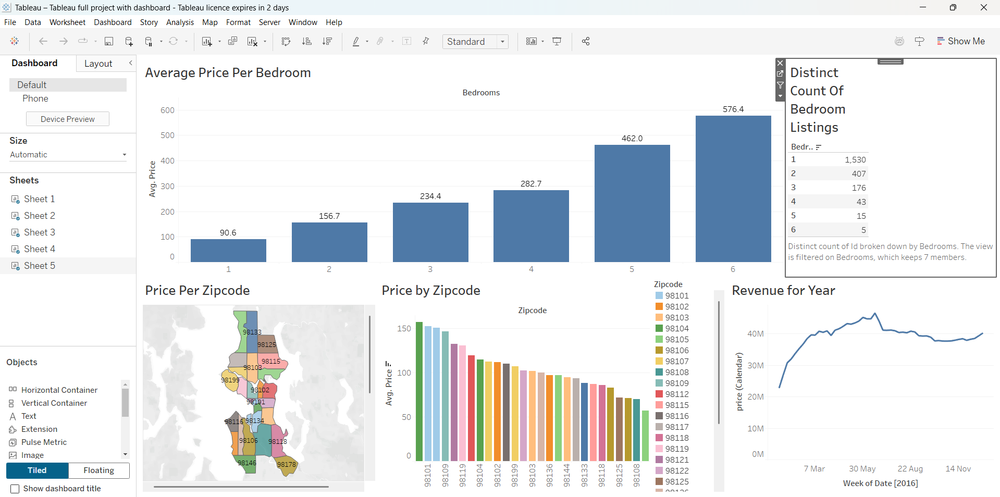

# Tableau Data Visualization Project

## 📋 Project Overview

This project showcases an interactive data dashboard built in Tableau. The goal was to take a raw dataset, transform it into clear visual plots, and uncover insights that could support business decision-making. The dashboard is designed to be user-friendly, visually engaging, and analytically valuable.

## 🖼 Dashboard Preview

- 

## 🎯 Objectives

- Create a dynamic and interactive Tableau dashboard

- Summarize key metrics with charts and filters

- Make insights accessible to technical and non-technical audiences

- Enhance data storytelling through intuitive visual design

## 🛠 Tools & Technologies

- Tableau (for dashboard development)

- Excel (for initial data preparation and cleaning)

## 📊 Key Features

- Interactive Filters: Allow users to explore the data by category, time period, or other dimensions

- KPIs and Metrics: Displayed using clean and consistent formatting

- Visual Highlights: Color-coded trends and high-level summaries for instant insight

- Responsive Layout: Structured to ensure easy navigation and comprehension

